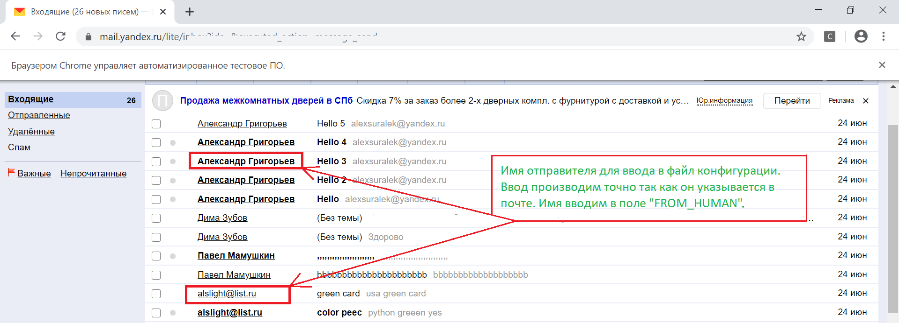

# test_selenium
Простой кейс использования python и selenium для авторизации и управления почтой на yandex.ru. С помощью программы можно входить в почту, считать количество писем от отправителя и направлять ответ.

## Задача
Разработать программу для автоматического входа в яндекс-почту с помощью selenium, подсчета писем от определенного отправителя и направление ему ответа с количеством входящих от него писем.
Использовать браузер google chrome или firefox.

## Конфигурация и запуск
1. Перед запуском программы откройте файл конфигурации `config/config.json`. 
2. В поле "MYLOGIN" введите адрес электронной почты для yandex.ru
3. В поле "MYPASSWORD" введите пароль от вашей почты.
4. Поле "URL" по умолчанию `https://yandex.ru`
5. Поле "FROM_HUMAN" введите имя отправителя как на скриншоте 
   Например, если вы хотите найти все письма от Александра Григорьева, в поле "FROM_HUMAN" необходимо ввести **Александр Григорьев**. 
   Если имя отправителя совпадает с e-mail адресом необходимо ввести **e-mail адрес** как в другом случае.
   Программа ведет поиск именно по **имени отправителя**. Его e-mail адрес для написания ответа программа забирает сама. Поэтому перед запуском посмотрите имя отправителя папке    "Входящие" или "Спам" если не знаете точно как его отображает браузер. Данное имя может не совпадать с e-mail адресом!!!
6. Для правильной работы все поля в файле конфигурации должны быть заполненны правильно.
7. Перед запуском программы установите зависимости командой `pip install -r requirements.txt`.
8. Установите браузер google chrome.
9. Запустите программу командой `python3.7 ya_go.py`
10. Поддержка python3.7 и выше.

## Модули
1. Папка `chromedrivermodul` исполняемый драйвер `chromedriver.exe`. Драйвер необходим для запуска Google Сhrome.
2. `Yamailenter/yandexmail.py` содержит класс для управления авторизацией и поиска писем от отправителя.

